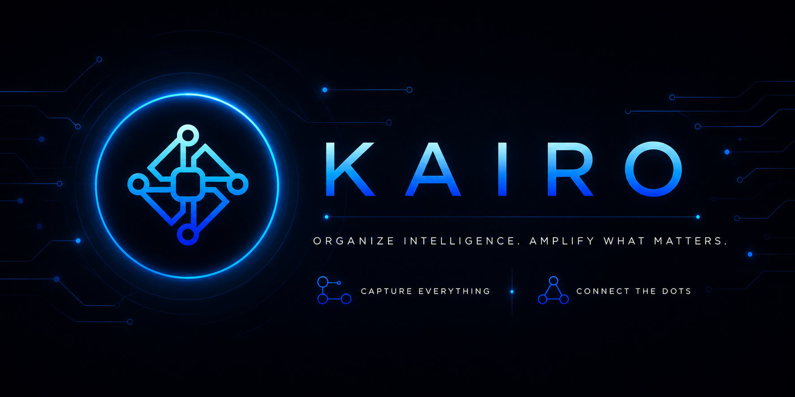

<div align="center">



### The Context Capture Extension for Modern AI Workflows

[]()
[](https://github.com/satyakiabhijit/Kairo/issues)
[](./CONTRIBUTING.md)

</div>

<div align="center">

</div>

<div align="center">


</div>

---

## 🕹️ `// KAIRO :: MISSION BRIEF`

Kairo is a cross-browser extension that captures context from supported AI chat platforms and saves it as reusable capsules. It is designed to reduce repetition when moving between Claude, ChatGPT, Gemini, and DeepSeek.

---

## ⭐ `// CONTRIBUTOR CHECKPOINT`

Before claiming an issue or submitting a PR, contributors are expected to:

- ⭐ Star this repository
- 🍴 Fork the repository
- 📖 Read [CONTRIBUTING.md](./CONTRIBUTING.md)

---

## ✨ `// FEATURE LOADOUT`

- **One-click capture**: Instantly save context from supported chat pages (Claude, ChatGPT, Gemini, DeepSeek).
- **Search & Filter**: Find saved capsules by title, summary, tag, platform, or folder.
- **Context Injection**: Inject saved context back into a chat input effortlessly.
- **Optional API Enrichment**: Use Claude API to generate structured metadata.
- **Cross-Browser**: Supports Chrome, Firefox, Edge, Brave, and Opera via the same codebase.
- **Data Portability**: JSON export and import for backup and migration.
- **Keyboard Shortcuts**: Native shortcut support for fast capture (`Ctrl+Shift+S`).

---

## 🧱 `// TECH STACK`

- **Core**: HTML, CSS, JavaScript (Browser Extension APIs)
- **Runtime**: Node.js 18 or newer, npm 9 or newer
- **Storage**: Browser Local Storage & Sync Storage

---

## 🚀 `// QUICK START (10 MIN QUEST)`

### 📥 For Non-Coders (Easy Install)
If you don't have coding experience, you can easily download and add the extension:
1. Go to the [Releases](https://github.com/satyakiabhijit/Kairo/releases) page and download the latest `.zip` file.
2. Extract the downloaded `.zip` file to a folder on your computer.
3. Open your browser extensions page (`chrome://extensions/` for Chrome/Edge/Brave).
4. Turn on **Developer mode** in the top right corner.
5. Click **Load unpacked** and select the extracted folder.

### 💻 For Developers

#### 1. Install & Build

```bash
git clone https://github.com/satyakiabhijit/Kairo.git
cd Kairo
npm install
npm run build
```

This generates a production build. Alternatively, use `npm run dev` to start a watch build for the Chrome target. For Firefox builds, use `npm run build:firefox` or `npm run dev:firefox`.

#### 2. Loading the Extension

##### Chrome, Edge, or Brave
1. Run `npm run build` or `npm run dev`.
2. Open the browser extensions page (`chrome://extensions/`).
3. Enable **Developer mode**.
4. Load the `dist-chrome/` folder as an unpacked extension.

##### Firefox
1. Run `npm run build:firefox` or `npm run dev:firefox`.
2. Open `about:debugging#/runtime/this-firefox`.
3. Load the extension from the `dist-firefox/` folder.

#### 3. Configuration
Open the extension settings page to configure:
- Claude API key for optional enrichment
- Automatic enrichment on capture
- Visibility of the floating capture button

---

## 🗺️ `// ROADMAP`

- [ ] Support for additional AI chat platforms.
- [ ] Tagging and categorisation enhancements.
- [ ] Syncing capsules across devices.

---

## 🤝 `// CONTRIBUTING`

> **⏳ Submission Deadlines:** All contributions and pull requests must be finalized and submitted prior to the specific deadlines outlined in their respective issues or associated events to be eligible for review.

> [!CAUTION]
> **🚨 ELUSOC ZERO-TOLERANCE ANTI-FRAUD POLICY 🚨**
> As the project admin, I strictly monitor all ELUSOC contributions. Any attempt to "farm" points, use bots/automation for issue/PR creation, inflate line counts using stacked branches, split a single logical task into multiple trivial PRs, or inject irrelevant code will result in **immediate rejection of all PRs, stripping of all points, and a permanent ban** from contributing to this repository. Do real work or do not contribute.

I welcome contributors of all levels.
Start with open issues, claim one, and submit a focused PR with clean commit history.

- Contribution guide: [CONTRIBUTING.md](./CONTRIBUTING.md)
- Code of Conduct: [CODE_OF_CONDUCT.md](./CODE_OF_CONDUCT.md)
- Security Policy: [SECURITY.md](./SECURITY.md)

---

## 🧭 `// ARCHITECTURE & DOCS`

- [Architecture overview](./architechture.md)
- [Changelog](./CHANGELOG.md)

---

## 📄 `// LICENSE`

This project is licensed under the MIT License.
See [LICENSE](./LICENSE) for details.
